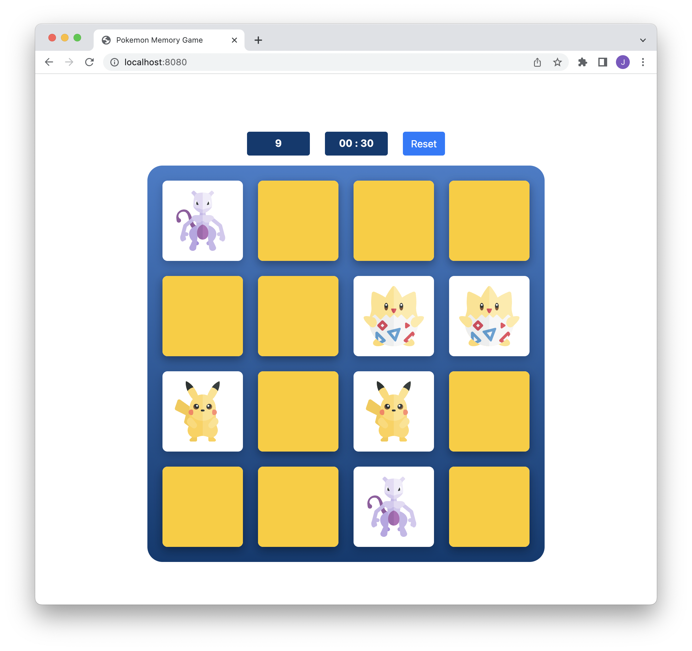

# Pokemon Memory Game
Simple Pokèmon themeed emory game built with JavaScript



### Setup Instructions
1. Install JS packages
```
yarn install
```

2. Start dev-server
```
yarn start
````

### Scripts
To start the local Webpack Dev Server (usually on port `8080`):

```bash
yarn start
```

To build production files:

```bash
yarn build
```

To deploy to GitHub Pages:
```bash
yarn create-gh-pages
```

## Todo
Timer currently only supports 4 digits. `99:99`
